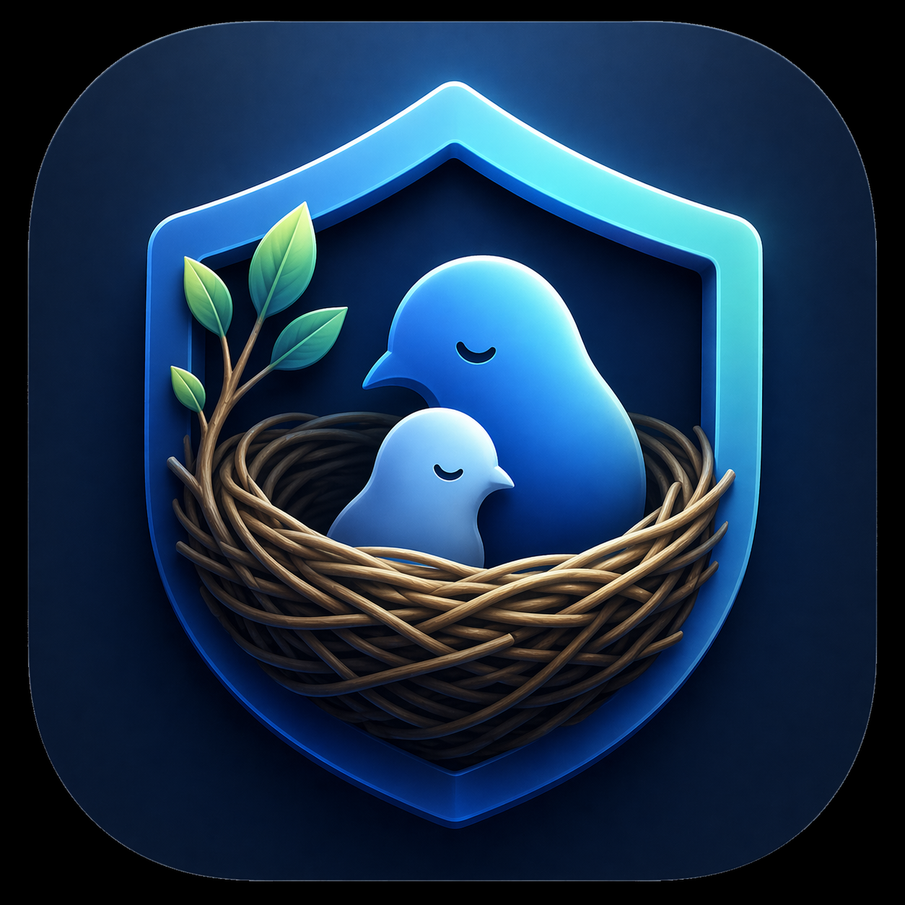
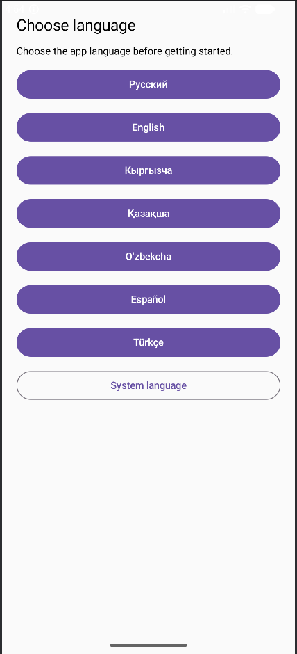
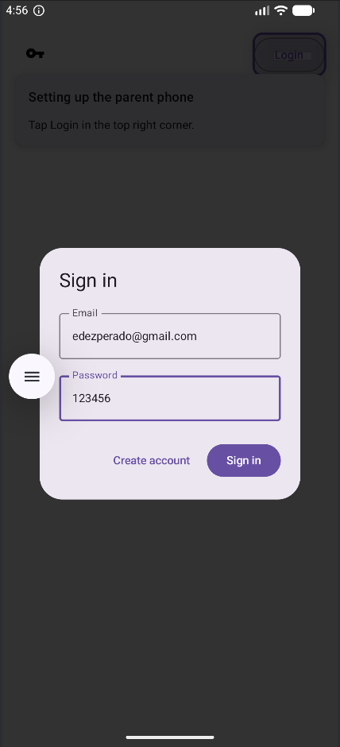
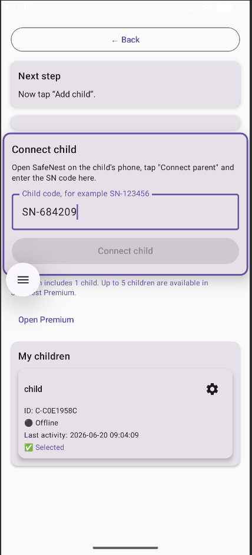
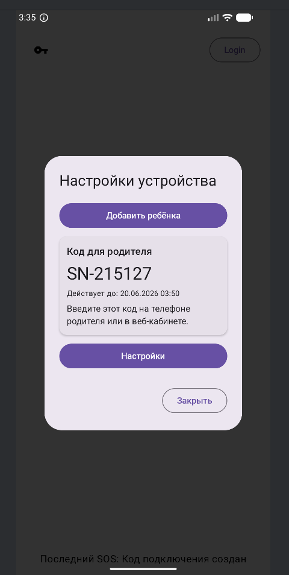

<p align="center">
  <a href="https://www.mysafenestapp.com">
    
  </a>
</p>

<h1 align="center">SafeNest</h1>

<p align="center">
  Child Safety Platform for Android
</p>

<p align="center">
  <a href="https://www.mysafenestapp.com"><b>🌐 Website</b></a> •
  <a href="https://www.linkedin.com/in/artem-kasymbekov-47929541a/"><b>LinkedIn</b></a>
</p>


SafeNest is a modern child safety platform that helps parents stay connected with their children while respecting privacy.

> ⚠️ Source code is private.
> This repository showcases the project architecture, features and technologies.

---

# ✨ Features

- 👨‍👩‍👧 Parent & Child pairing
- 🚨 SOS emergency system
- 🔔 Notification monitoring
- 📱 Screen time statistics
- 📍 Location sharing
- 👑 Premium activation system
- 🔐 Secure authentication
- ☁️ Cloud backend
- 📡 Push notifications

---

---

# 📱 Application Preview

<table>
<tr>
<td align="center">

### 🌍 Language Selection



</td>

<td align="center">

### 🔐 Sign In



</td>
</tr>

<tr>
<td align="center">

### 👨‍👦 Pair Child



</td>

<td align="center">

### 🔗 Connect Device



</td>
</tr>

<tr>
<td colspan="2" align="center">

</table>

---

# 🏗️ System Architecture

```text
             Android App
                  │
          HTTPS REST API
                  │
          FastAPI Backend
                  │
             SQLite DB
                  │
         Firebase Cloud Messaging
```

---

# 🛠 Tech Stack

### Android

- Kotlin
- Jetpack Compose
- MVVM
- Room
- Coroutines

### Backend

- Python
- FastAPI
- SQLite
- REST API

### Infrastructure

- Linux
- Nginx
- Docker
- VPS

---

# 📱 Application Modules

- Parent Dashboard
- Child Application
- Pairing System
- Premium Management
- Notification Processing
- SOS Service

---

# 🔒 Privacy

The complete source code is private.

This repository is intended only to demonstrate the project architecture and technologies used.

---
## 🌐 Official Website

👉 https://www.mysafenestapp.com

# 👨‍💻 Developer

Artem Kasymbekov

Backend & Android Developer

LinkedIn:
https://www.linkedin.com/in/artem-kasymbekov-47929541a/
